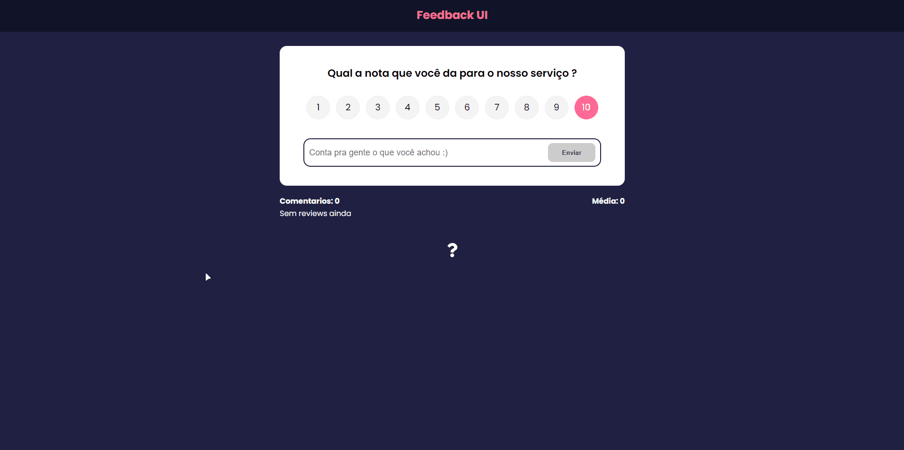
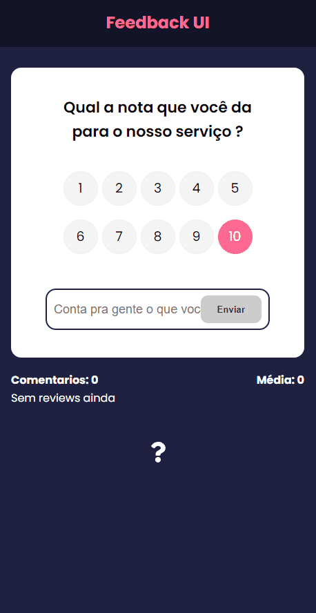

<h1 align="center">
    Feedback UI
</h1>

<h4 align="center"> 
	✔️ Concluido ✔️
</h4>


## 🎨 Layout

O layout da aplicação:

<div align="center">
  <h1>💻Desktop Version</h1>
  
  
  <h1>📱Mobile Version</h1>
       
</div>

---

## 💻 Sobre o projeto

✍️ Feedback UI - é uma web aplicação que permite o usuario escrever reviews .

---

## ⚙️ Funcionalidades

- [x] Usuario pode criar as Reviews.
- [x] Usuario pode Deletar as Reviews.
- [x] Usuario pode Editar as Reviews.
- [x] Dados são salvos no Json DB.

---

## 🛠 Tecnologias

As seguintes ferramentas foram usadas na construção do projeto:

-   **[ReactJS](https://github.com/reactjs)**
-   **[CSS3](https://github.com/topics/css3)**
-   **[Javascript](https://github.com/topics/javascript)**
-   **[JSON Database](https://www.npmjs.com/package/node-json-db)**

---

## 🚀 Como executar o projeto

-   Você pode testar o projeto aqui: **[Feedback UI](https://feedback-uiweb.vercel.app)**

```bash

# Clone este repositório
$ git clone https://github.com/lucassoares01/dev-money

#Para iniciar na sua maquina, de os comandos: 

- npm start para a aplicção
- npm run server para o JSON Database.

```

---
